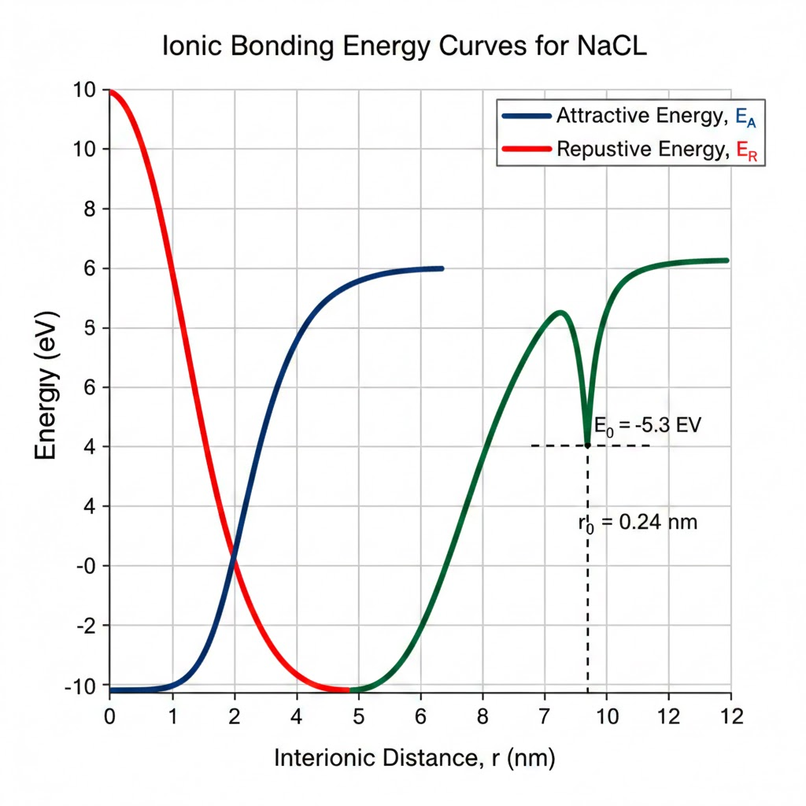

# Løsningsforslag: Obligatorisk innlevering nr. 1 - MAS144

## Oppgave 1: Ionisk binding for NaCl

**a) Plot av energikurver**
For å generere plottet benyttes følgende funksjoner for avstanden r fra 0 til 1,2 nm:
* **Tiltrekkende energi:** $E_{A} = -\frac{1,436}{r}$
* **Frastøtende energi:** $E_{R} = \frac{7,32 \cdot 10^{-6}}{r^{8}}$
* **Nettoenergi:** $E_{N} = E_{A} + E_{R}$

**b) Grafisk avlesning**
Ved å studere minimumspunktet på kurven for $E_{N}$ i diagrammet (der kurven snur) finner man:
* **Likevektsavstand ($r_{0}$):** Ca. 0,24 nm.
* **Potensiell energi ($E_{c}$):** Ca. -5,3 eV.

**c) Beregning av $r_{0}$ og $E_{0}$**
For å finne $r_{0}$ matematisk settes den deriverte av nettoenergien lik null:
$$\frac{dE_{N}}{dr} = \frac{1,436}{r^{2}} - \frac{8 \cdot 7,32 \cdot 10^{-6}}{r^{9}} = 0$$

Løser for $r_{0}$:
$r_{0} \approx 0,236 \text{ nm}$

Innsetting av $r_{0}$ i formelen for $E_{N}$ gir $E_{0}$:
$E_{0} \approx -5,32 \text{ eV}$

---

## Oppgave 2: Smeltetemperatur og bindingsenergi

Basert på tabell 2.3 lages en trendlinje i Excel med smeltetemperatur [°C] på x-aksen og bindingsenergi [eV] på y-aksen.

**Beregning for Molybden (Mo):**
* Smeltepunkt for Mo: $2617^{\circ}C$.
* Ved å bruke trendlinjen (y = mx + b) fra tabellens data, finner vi at bindingsenergien for Molybden er ca. **6,8 eV**.

---

## Oppgave 3: Krystallstrukturer og tetthet

**a) Pakkefaktor (APF) for BCC**
I en BCC-celle er det 2 atomer. Forholdet mellom sidelengden $a$ og radius $R$ er $a = \frac{4R}{\sqrt{3}}$.
$$APF = \frac{V_{atomer}}{V_{celle}} = \frac{2 \cdot (\frac{4}{3}\pi R^{3})}{(\frac{4R}{\sqrt{3}})^{3}} = 0,68$$

**b) Pakkefaktor (APF) for FCC**
I en FCC-celle er det 4 atomer. Forholdet er $a = \frac{4R}{\sqrt{2}}$.
$$APF = \frac{4 \cdot (\frac{4}{3}\pi R^{3})}{(\frac{4R}{\sqrt{2}})^{3}} = 0,74$$

**c) Teoretisk tetthet for jern (Fe)**
* **Struktur:** BCC ($n=2$)
* **Atommasse (A):** 55,85 g/mol
* **Radius (R):** 0,124 nm = $1,24 \cdot 10^{-8} \text{ cm}$
* **Avogadros tall ($N_{A}$):** $6,022 \cdot 10^{23} \text{ mol}^{-1}$
* **Beregning:**
$\rho = \frac{n \cdot A}{V_{C} \cdot N_{A}} = \frac{2 \cdot 55,85}{(\frac{4 \cdot 1,24 \cdot 10^{-8}}{\sqrt{3}})^{3} \cdot 6,022 \cdot 10^{23}} \approx 7,88 \text{ g/cm}^{3}$

---

## Oppgave 4: Materialegenskaper

* **a) Atomstruktur vs. Krystallstruktur:** Atomstruktur omhandler oppbygningen av det enkelte atom (elektroner/kjerne), mens krystallstruktur beskriver hvordan atomer er organisert i et repeterende mønster i rommet.
* **b) Polymorfi/Allotropi:** Evnen et materiale har til å endre krystallstruktur ved endring i temperatur eller trykk. Eksempler: Jern (Fe), Karbon (C) og Titan (Ti).
* **c) Polykrystallinske materialer:** Består av mange små krystallkorn. De er ofte isotropiske fordi de tilfeldige retningene til hvert korn utligner hverandre, slik at egenskapene blir like i alle retninger.

---

## Oppgave 5: Hypotetisk metall

**a) Krystallsystem:**
Siden vinklene er $90^{\circ}$ og dimensjonene er $0,30 \text{ nm} \times 0,30 \text{ nm} \times 0,40 \text{ nm}$ ($a=b \neq c$), er dette det **tetragonale** systemet.

**b) Krystallstruktur:**
Figuren viser et atom i hvert hjørne og ett i midten, som tilsvarer **Body-Centered Tetragonal (BCT)**.

**c) Tetthet:**
* **Antall atomer (n):** 2
* **Atomvekt (A):** 145 g/mol
* **Volum ($V_{C}$):** $0,3 \cdot 0,3 \cdot 0,4 \text{ nm}^{3} = 0,036 \text{ nm}^{3} = 3,6 \cdot 10^{-23} \text{ cm}^{3}$
* **Tetthet ($\rho$):**
$\rho = \frac{2 \cdot 145}{3,6 \cdot 10^{-23} \cdot 6,022 \cdot 10^{23}} \approx 13,38 \text{ g/cm}^{3}$